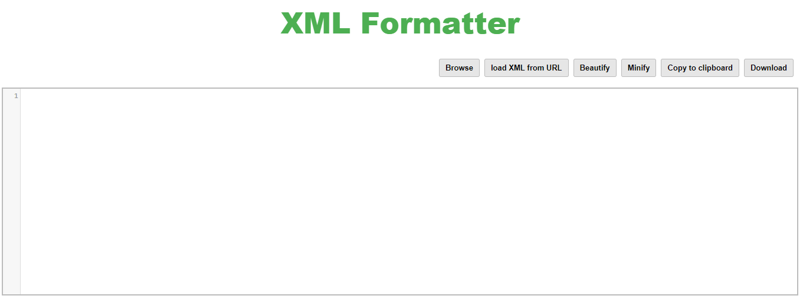

# Web XML Formatter

Web XML Formatter is a web-based XML Formatter tool written in JavaScript.
It allows to minify and beautify XML.

This tool is still basic and needs to be improved.

Try the demo here: [https://extendsclass.com/xml-formatter-online.html](https://extendsclass.com/xml-formatter-online.html)

## Dependencies 

This tool required:
 * [CodeMirror](https://github.com/codemirror/CodeMirror) (MIT license)
 * [A11y dialog](https://github.com/edenspiekermann/a11y-dialog) (MIT license)
 
## Install

Drop the files into a directory (on a server or on your PC) and then visit in a browser. 

## Launch tests

Not implemented.

## License

MIT
